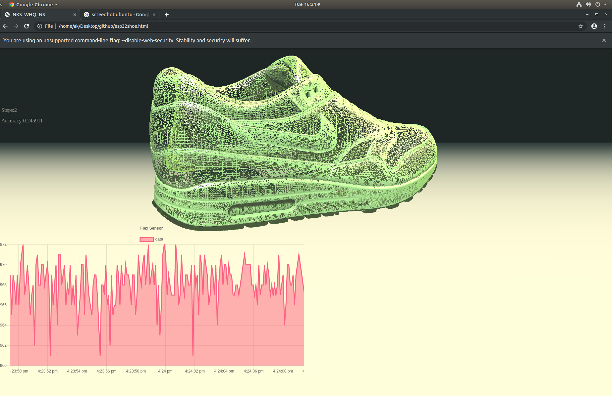

# nkshoe

## Building a position and flex aware shoe that connects wirelessly in realtime to the web.  




  
## Hardware:  
 - esp32 - SparkFun Thing Plus - ESP32 WROOM (https://www.sparkfun.com/products/14689)  
 - IMU - SparkFun BNO080 (https://www.sparkfun.com/products/14686)  
 - flexsensor - SparkFun Qwiic Flex Glove Controller (https://www.sparkfun.com/products/14666)  
  
## Software:  
 ESP32:  
  - Arduino IDE (https://www.arduino.cc/en/main/software)  
  - Websockets (https://github.com/Links2004/arduinoWebSockets)  
  - ArduinoJson (https://arduinojson.org/?utm_source=meta&utm_medium=library.properties)  
  - SparkFun ADS1015 Arduino Library (https://github.com/sparkfun/SparkFun_ADS1015_Arduino_Library)  
  - SparkFun BNO080 Arduino Library (https://github.com/sparkfun/SparkFun_BNO080_Arduino_Library)  
  - NTPClient (https://github.com/arduino-libraries/NTPClient)</br>
  
 Web:  
  - html/css  
  - Three JS (https://www.threejs.org)  
  - Moment JS (https://momentjs.com/)  
  - Chart JS (https://www.chartjs.org/)  
  - Chart Streaming Plugin (https://nagix.github.io/chartjs-plugin-streaming/)  
  - Free stl show model (https://sketchfab.com/3d-models/shoe-stl-8bc37802b11240f6bad3bb3b60e682ae#download)  
  
## Building instructions:  
  
1.) Install Arduino IDE and follow the instructions to setup the esp32 feather board:  
https://learn.adafruit.com/adafruit-huzzah32-esp32-feather/using-with-arduino-ide  
  
2.) Install all the required libraries from above. (Software/ESP32)  
  
3.) Open esp32shoe.ino and change the Wifi Credentials to your home wifi on line 27 and 28. 
  
4.) Change the board definitions in Arduino IDE to adafruit esp32 feather and upload the sketch. (select baud speed 921600/80/none)  
  
5.) Open Google Chrome or Mozilla Firefox with CORS disabled.  
(See: https://medium.com/@siddhartha.ng/disable-cross-origin-on-chrome-for-localhost-c644b131db19)  
  
6.) Make sure you and the shoe are in the same Wifi network. 
  
7.) Open esp32shoe.html and change line 145 and 294  ```ws = new WebSocket("ws://172.20.10.6/ws");``` to your esp32's ip address.  
  
8.) Download a free stl model of a shoe and place it in the ascii folder.  
(https://sketchfab.com/3d-models/shoe-stl-8bc37802b11240f6bad3bb3b60e682ae)  
If its a different model rename it to SHOE_STL.stl or change line 132 in esp32shoe.html.  
If the model is to small or too big change line 137 in esp32shoe.html.  
  
9.) Open esp32shoe.html  
  
10.) Check developertools/network/ws for websocket connections.  
  
11.) Enjoy.  
  
  
## TODO:  
- [x] Fix quaternion rotation error.  
- [ ] Reduce websocket connections from two to one.  
- [ ] Work on flex accuracy.  
- [ ] Reduce stl model to allower speedier movement.  
- [ ] Add calibration to imu and flex sensor.  
- [ ] Much more.  
  

